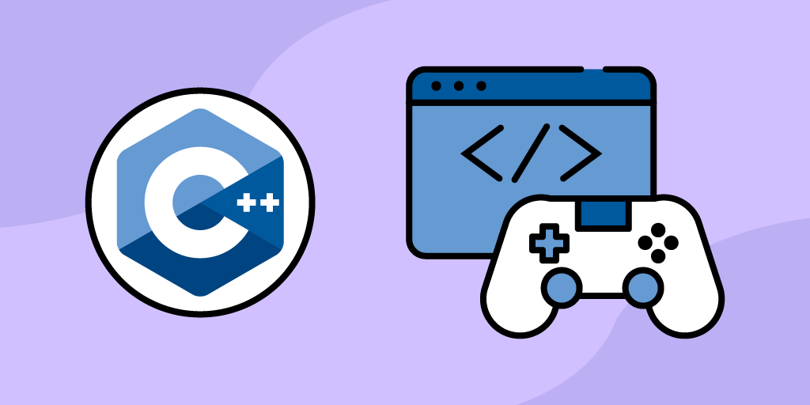

# C++ Games

Overview
This repository is a collection of simple and entertaining games developed using the C++ programming language. It serves as a starting point for game development enthusiasts to explore and experiment with game programming concepts in C++.

Key Features
Diverse Games: The repository includes a variety of games, ranging from classic console-based games to more interactive graphical games using libraries like SFML or SDL.

Learning Resources: Each game comes with a detailed README explaining the game mechanics, design principles, and implementation details. This makes it an excellent resource for learning game development in C++.

Modifiability: Feel free to customize, expand, and modify the games. Use them as a foundation for your own game development projects, and share your creations with the community.

Community Contributions: Contributions and feedback from the community are encouraged. Whether you want to enhance existing games or add new ones, your input is valuable.

Getting Started
To dive into the world of C++ game development, ensure you have a C++ compiler and, if applicable, the necessary game development libraries like SFML or SDL installed on your system. Explore the individual game folders for instructions on building and running each game.

Example Usage:
// Example usage for a console-based game
#include <iostream>
#include "path/to/game_file.h"

int main() {
    // Launch the game
    Game::start();

    return 0;
}

Contributing
If you have ideas for new games, improvements to existing ones, or if you've discovered and fixed bugs, we welcome your contributions. Follow the guidelines in the repository to contribute effectively and enhance the collection for everyone.
